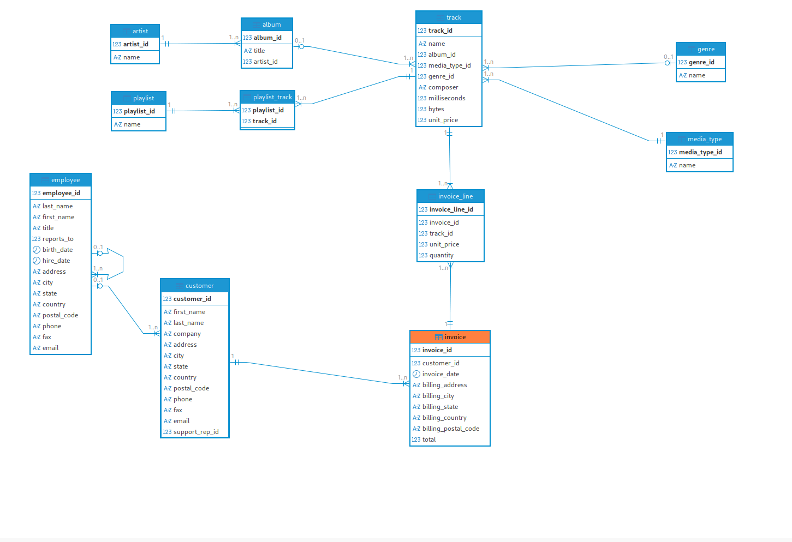

# 📊 Analyzing Northwind Database Using PostgreSQL
This repository contains a collection of SQL queries and views for analyzing the classic Northwind sample database using PostgreSQL.
The database can be found [here](https://github.com/lerocha/chinook-database). The picture below gives an overview of the northwind database.



---

## 🧭 Overview

The project covers:

- Customer Behavior
- Product & Artist Performance
- Revenue aggregation
- Time-based analysis
- Revenue Aggregation
- Time-Based Analysis
- Ranking & Top Performers
- Behavioral Patterns
- Executive KPIs

---

# 🚀 Goals

<details>
<summary><strong>Goal 1 – Top 5 Artists Ranked by Sales</strong></summary>
<br>

### 🎯 Goal
- Identify the top 5 artists generating the highest total revenue.

### 🧾 SQL Query
```sql
with t_total_sales as (
	select distinct
		a2."name" as artist,
		sum(il.unit_price * il.quantity) as total
	from 
		invoice i 
	join 
		invoice_line il on i.invoice_id = il.invoice_id 
	join 
		track t on il.track_id = t.track_id
	join 
		album a on a.album_id = t.album_id
	join 
		artist a2 on a.artist_id = a2.artist_id
	group by 
		artist
),
t_total_sales_rank as (
	select 
		*,
		rank() over (order by total desc) as rk
	from 
		t_total_sales
)
select	
	*
from 
	t_total_sales_rank
where 
	rk <= 5
;

```

</details>

<details>
<summary><strong>Goal 2 – Average Track Length by Genre</strong></summary>
<br>
  
### 🎯 Goal
- Calculate the average track duration (in seconds) for each genre and rank genres by longest average duration.

### 🧾 SQL Query
```sql
select 
	g."name" as genre,
	round(
		avg(t.milliseconds) / 1000, 
		2
	) avg_track_length_in_sec
from 
	track t 
join 
	genre g on t.genre_id = g.genre_id
group by 
	genre 
order by 
	avg_track_length_in_sec desc
;
```

</details>

<details>
<summary><strong>Goal 3 – Customers with More Than 5 Invoices</strong></summary>
<br>
  
### 🎯 Goal
- Identify customers who have placed at least 5 invoices, including their name, city, and invoice count.

### 🧾 SQL Query
```sql
-- APPROACH 1
select 
	c.first_name,
	c.last_name,
	c.city,
	ci.count_invoices 
from (
	select 
		c.customer_id,  
		count(distinct i.invoice_id) as count_invoices
	from 
		invoice i 
	join 
		customer c on i.customer_id = c.customer_id
	group by 
		c.customer_id 
	having 
		count(i.invoice_id) >= 5
) ci 
join 
	customer c on ci.customer_id = c.customer_id 
;
```

```sql
-- APPROACH 2
select 
	c.first_name,
	c.last_name,
	c.city, 
	count(distinct i.invoice_id) as count_invoice
from 
	invoice i 
join 
	customer c on i.customer_id = c.customer_id
group by 
	c.customer_id 
having 
	count(distinct i.invoice_id) >= 5
;
```

</details>

<details>
<summary><strong>Goal 4 – Total Sales per Country</strong></summary>
<br>
  
### 🎯 Goal
- Compute total revenue per billing country based on invoice totals and rank countries by sales.

### 🧾 SQL Query
```sql
select 
	i.billing_country,
	sum(i.total) as total_sales
from 
	invoice i
group by 
	i.billing_country
order by 
	total_sales desc
; 	
```

</details>


<details>
<summary><strong>Goal 5 – Most Frequently Purchased Tracks</strong></summary>
<br>
  
### 🎯 Goal
- Determine which tracks have been sold the most based on total quantity purchased across all invoices.

### 🧾 SQL Query
```sql
select 
	t.name as track_name,
	sum(il.quantity) as track_count
from 
	invoice_line il 
join 
	track t on il.track_id = t.track_id
group by 
	t.track_id 
order by 
	track_count desc
; 
```

</details>


<details>
<summary><strong>Goal 6 – Playlists Containing Jazz Tracks</strong></summary>
<br>
  
### 🎯 Goal
- Identify all playlists that contain at least one track belonging to the 'Jazz' genre.

### 🧾 SQL Query
```sql
select distinct
    p.name
from 
	playlist p
join 
	playlist_track pt on pt.playlist_id = p.playlist_id
join 
	track t on t.track_id = pt.track_id
join 
	genre g on g.genre_id = t.genre_id
where 
	g.name = 'Jazz'
;
```

</details>


<details>
<summary><strong>Goal 7 – Employee Performance: Total Sales and Customer Count</strong></summary>
<br>
  
### 🎯 Goal
- For each employee, calculate the total revenue generated by the customers they support and count the number of distinct customers.

### 🧾 SQL Query
```sql
select 
	e.first_name,
	e.last_name,
	count(distinct c.customer_id),
	sum(i.total) as total_sales
from 
	invoice i 
join 
	customer c on c.customer_id = i.customer_id
join 
	employee e on e.employee_id = c.support_rep_id
group by 
	e.first_name, 
	e.last_name
order by 
	total_sales desc
; 
```

</details>


<details>
<summary><strong>Goal 8 – Average Track Price per Album and Artist</strong></summary>
<br>
  
### 🎯 Goal
- Compute the average unit price of tracks for each album, including artist and album name.

### 🧾 SQL Query
```sql
select 
	a2.name as artist,
	a.title as album_name,
	avg(t.unit_price)
from 
	track t 
join 
	album a on t.album_id = a.album_id
join 
	artist a2 on a.artist_id = a2.artist_id
group by 
	album_name, 
	artist  
; 
```

</details>


<details>
<summary><strong>Goal 9 – Top 3 Genres by Total Sales</strong></summary>
<br>
  
### 🎯 Goal
- Identify the three genres generating the highest total revenue, based on invoice line sales.

### 🧾 SQL Query
```sql
select 
	g.name as genre,
	sum(il.quantity * il.unit_price) as total_sales
from 
	invoice_line il 
join 
	track t on t.track_id = il.track_id 
join 
	genre g on t.genre_id = g.genre_id
group by 
	genre
order by 
	total_sales desc
limit 3
;
```

</details>


<details>
<summary><strong>Goal 10 – Customers Not Purchasing in the Latest Year</strong></summary>
<br>
  
### 🎯 Goal
- Identify customers who did not make any purchases in the most recent year present in the invoice data.

### 🧾 SQL Query
```sql
select distinct
 	base.first_name,
 	base.last_name
from (
	select 
		c.customer_id,
		c.first_name,
		c.last_name,
		i.total,
		i.invoice_date,
		i.invoice_id,
		extract(
			year from max(i.invoice_date) over ()
		) as max_year,
		extract(
			year from max(i.invoice_date) over(partition by c.customer_id)
		) as max_year_per_customer
	from 
		invoice i 
	join 
		customer c on i.customer_id = c.customer_id
	) base
	where 
		base.max_year <> base.max_year_per_customer
;
```

</details>

<details>
<summary><strong>Goal 11 – Tracks Appearing in at Least 3 Playlists</strong></summary>
<br>
  
### 🎯 Goal
- Identify tracks that appear in at least three different playlists.

### 🧾 SQL Query
```sql
select 
	base.track_name
from (
	select
		t.track_id,
		t.name as track_name,
		count(pt.playlist_id) count_playlist
	from 
		track t 
	join 
		playlist_track pt on t.track_id = pt.track_id
	group by 
		t.track_id
) base
where 
	base.count_playlist >= 3
; 
```

</details>


<details>
<summary><strong>Goal 12 – Albums with Average Track Length Over 5 Minutes</strong></summary>
<br>
  
### 🎯 Goal
- Identify albums whose average track duration exceeds 300 seconds.

### 🧾 SQL Query
```sql
select 
	* 
from (
	select 
		a.title as album,
		round(
			avg(t.milliseconds), 
			2
		) as avg_len
	from 
		album a 
	join 
		track t on t.album_id = a.album_id
	group by 
		album
) base
where 
	base.avg_len > 300000
;


```

</details>


<details>
<summary><strong>Goal 13 – Top 5 Customers by Average Invoice Total</strong></summary>
<br>
  
### 🎯 Goal
- Identify the top 5 customers ranked by highest average invoice total.

### 🧾 SQL Query
```sql
select 
	c.first_name,
	c.last_name,
	round(
		avg(i.total),
		3
	)as avg_sales
from 
	invoice i 
join 
	customer c on c.customer_id = i.customer_id
group by 
	c.customer_id, 
	c.first_name, 
	c.last_name
order by 
	avg_sales desc
limit 5
; 
```

</details>


<details>
<summary><strong>Goal 14 – Artists with the Most Tracks</strong></summary>
<br>
  
### 🎯 Goal
- Determine the number of tracks associated with each artist and rank artists by total track count.

### 🧾 SQL Query
```sql
select 
	a2.name as artist_name,
	count(t.track_id) as count_tracks
from 
	track t 
join 
	album a on a.album_id = t.album_id
join 
	artist a2 on a2.artist_id =a.artist_id
group by 
	a2.artist_id
order by 
	count_tracks desc
; 
```

</details>


<details>
<summary><strong>Goal 15 – Average Track Price by Media Type</strong></summary>
<br>
  
### 🎯 Goal
- Compute the average track price for each media type.

### 🧾 SQL Query
```sql
select 
	mt.name as media_type,
	avg(t.unit_price) 
from 
	track t 
join 
	media_type mt on mt.media_type_id = t.media_type_id
group by 
	media_type 
; 
```

</details>

<details>
<summary><strong>Goal 16 – Customers with the Most Diverse Genre Purchases</strong></summary>
<br>
  
### 🎯 Goal
- Identify the customers who have purchased tracks from the highest number of distinct genres.

### 🧾 SQL Query
```sql
with t_genre_count as (
	select 
		c.first_name,
		c.last_name,
		count(distinct g.genre_id) as genre_count
	from 
		invoice i 
	join 
		invoice_line il on il.invoice_id = i.invoice_id
	join 
		track t on il.track_id = t.track_id
	join 
		genre g on g.genre_id = t.genre_id
	join 
		customer c on c.customer_id = i.customer_id
	group by 
		c.customer_id 
),
t_genre_count_rank as (
	select
		*,
		rank() over(order by genre_count desc) as rk
	from 
		t_genre_count 
)
select 	
	tgcr.first_name,
	tgcr.last_name,
	tgcr.genre_count 
from 
	t_genre_count_rank tgcr
where 
	rk = 1
;

```

</details>


<details>
<summary><strong>Goal 17 - Revenue Contribution by Genre per Country</strong></summary>
<br>
  
### 🎯 Goal
- For each country, calculate the share of revenue contributed by each genre.
- Rank genres within each country from highest to lowest contribution.

### 🧾 SQL Query
```sql
-- slow
with t_percentage_share as (
	select distinct
		i.billing_country as country,
		g.name as genre,
		round(
		    (
		        sum(il.quantity * il.unit_price) over(partition by i.billing_country, g.name)
		        /
		        sum(il.quantity * il.unit_price) over(partition by i.billing_country)
			 ) * 100,
		    2
		) percentage_share
	from 
		invoice i 
	join 
		invoice_line il on i.invoice_id = il.invoice_id
	join 
		track t on t.track_id = il.track_id 
	join
		genre g on g.genre_id = t.genre_id
)
select 
	*,
	rank() 
	over(partition by country order by percentage_share desc) as percentage_share_rank
from 
	t_percentage_share
; 
```

```sql
-- faster
with t_sales_country_genre as (
	select
		i.billing_country as country,
		g.name as genre,
		sum(il.quantity * il.unit_price) as total_sales_per_genre
	from 
		invoice i 
	join 
		invoice_line il on i.invoice_id = il.invoice_id
	join 
		track t on t.track_id = il.track_id 
	join 
		genre g on g.genre_id = t.genre_id
	group by 
		country, 
		genre
),
t_sales_per_country as (
	select 
		*,
		sum(total_sales_per_genre) over(partition by country) as total_sales_per_country
	from t_sales_country_genre 
),
t_final as (
	select 
		country,
		genre,
		round(total_sales_per_genre / total_sales_per_country * 100, 2) as percentage_share
	from 
		t_sales_per_country
)
select 
	*,
	rank() over(partition by country order by percentage_share desc) as percentage_share_rank
from 
	t_final 
; 
```
</details>

<details>
<summary><strong>Goal 18 - Customers with Increasing Purchase Behavior</strong></summary>
<br>
  
### 🎯 Goal
- Identify customers whose invoice totals have strictly increased over their last 3 purchases.
- Return customer name and the last 3 invoice totals.

### 🧾 SQL Query
```sql
with t_rank as (
	select 
		*,
		(
			t.total > lead(t.total) over(partition by t.customer_id order by t.invoice_date desc)
		)::int as diff_total
	from (
		select 
			i.customer_id,
			i.total,
			i.invoice_date,
			row_number() over(partition by i.customer_id order by i.invoice_date desc) as rn
		from 
			invoice i
	) t
	where rn <= 3
),
t_final as (
	select 
		tr.customer_id,
		c.first_name,
		c.last_name,
		tr.total,
		tr.invoice_date,
		count(*) over (partition by tr.customer_id) as rc,
		sum(tr.diff_total) over(partition by tr.customer_id) as sdt
	from 
		t_rank tr
	join 
		customer c on c.customer_id = tr.customer_id
)
select
	tf.first_name,
	tf.last_name,
	tf.invoice_date,
	tf.total
from 
	t_final tf
where
	tf.rc = 3 and tf.sdt = 2
;
```

</details>

<details>
<summary><strong>Goal 19 - Cohort Analysis by First Purchase Year</strong></summary>
<br>
  
### 🎯 Goal
- Group customers by the year of their first invoice (cohort).
- For each cohort, calculate the average revenue per month since their first purchase.

### 🧾 SQL Query
```sql
with cohort_per_customer as (
  select
    customer_id,
    min(extract(year from invoice_date)) as cohort,
    min(invoice_date) as first_purchase_date
  from 
  	invoice
  group by 
  	customer_id
)
select 
	cpc.cohort,
	(
		extract(year from age(i.invoice_date, cpc.first_purchase_date)) * 12 
		+
		extract(month from age(i.invoice_date, cpc.first_purchase_date)) 
	) as duration,
	round(avg(i.total), 2) as avg_purchase
from 
	cohort_per_customer cpc
join 
	invoice i on cpc.customer_id = i.customer_id
group by  
	cpc.cohort, 
	duration
order by 
	cpc.cohort, 
	duration
;
```

</details>

<details>
<summary><strong>Goal 20 - Artists with High Genre Diversity</strong></summary>
<br>
  
### 🎯 Goal
- Identify artists who have tracks in at least 3 different genres.
- For each artist, list the genres and total track count per genre.

### 🧾 SQL Query
```sql
-- APROACH 1
select 
	artist_name,
	genre,
	count_tracks 
	from (
		select 
			*,
			count(genre) over(partition by id) as count_genre
		from (
			select 
				a.artist_id as id,
				a.name as artist_name,
				g.name as genre,
				count(t.name) as count_tracks
			from 
				artist a
			join 
				album a2 on a.artist_id = a2.artist_id
			join 
				track t on t.album_id = a2.album_id
			join 
				genre g on g.genre_id = t.genre_id
			group by
				id,
				artist_name,
				genre
			order by
				id asc
		)
	)
	where count_genre >= 3
;
```

```sql
-- APPROACH 2
with t_base_tracks as (  
	select 
		a.artist_id,
		t.genre_id, 
		count(t.name) as count_tracks
	from 
		track t
	join 
		album a on a.album_id = t.album_id
	group by
		a.artist_id,
		t.genre_id
),
t_base_genre as (
	select 
		tbt.artist_id,
		tbt.count_tracks,
		tbt.genre_id,
		count(tbt.genre_id) over(partition by tbt.artist_id) as count_genre
	from 
		t_base_tracks tbt
),
t_base_filter as (
	select
		tbg.artist_id,
		tbg.count_tracks,
		tbg.genre_id
	from 
		t_base_genre tbg
	where 
		tbg.count_genre >= 3
)
select 
	a2.name as artist,
	g.name as genre,
	tbf.count_tracks
from 
	t_base_filter tbf
join 
	genre g on g.genre_id = tbf.genre_id
join
	artist a2 on a2.artist_id = tbf.artist_id
;
```

```sql
-- APPROACH 3
with t_base as (  
	select 
		al.artist_id,
		t.genre_id, 
		count(t.name) as count_tracks
	from 
		track t
	join 
		album al on al.album_id = t.album_id
	group by
		al.artist_id,
		t.genre_id
),
t_artist as (
	select 
		tb.artist_id
	from 
		t_base tb
	group by 
		tb.artist_id
	having count(*) >= 3
)
select
	ar.name as artist,
	g.name as genre,
	tb.count_tracks
from 
	t_base tb
join 
	t_artist ta on ta.artist_id = tb.artist_id
join
	genre g on g.genre_id = tb.genre_id
join
	artist ar on ar.artist_id = tb.artist_id
;
```

<details>
<summary><strong>Goal 21 - Tracks Appearing in 20% or More of Playlists</strong></summary>
<br>
  
### 🎯 Goal
- Find tracks that appear in at least 20% of all playlists in the database.
- Return track name, artist, and number of playlists it appears in.

### 🧾 SQL Query
```sql
select 
	ar.name as artist,
	tr.name as track_name,
	q.playlist_count
from (
	select
	    g.track_id,
	    g.playlist_count
	from (
	    select
	        pt.track_id,
	        count(*) as playlist_count
	    from 
	    	playlist_track pt
	    group by 
	    	pt.track_id
	) g
	cross join (
	    select count(distinct playlist_id) as total_playlists
	    from 
	    	playlist_track
	) p
	group by 
		g.track_id,
		g.playlist_count,
		p.total_playlists
	having 
		round((g.playlist_count::numeric / p.total_playlists::numeric) * 100, 2) >= 20
) q
join 
	track tr on tr.track_id = q.track_id
join 
	album al on al.album_id = tr.album_id
join 
	artist ar on ar.artist_id = al.artist_id
order by 
	q.track_id
;

```

</details>

